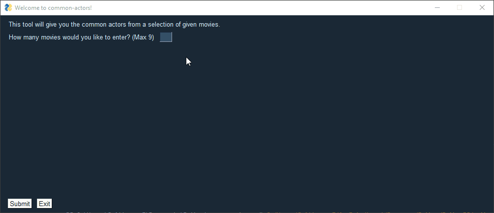

I developed a simple GUI using PysimpleGUI.

# common-actors
This is a simple Python3 script that returns common actors (and actresses) from movies specified by the user.
It uses the **IMDbPY** python package (https://imdbpy.github.io/)
I created this script because I couldn't remember the name of an actor, but I could think of some movies that he was in. This script found the Actor for me. 

It is very simple to use...

Use: (see requirements)
- Python 3.8
- IMDbPY
- PySimpleGUI

